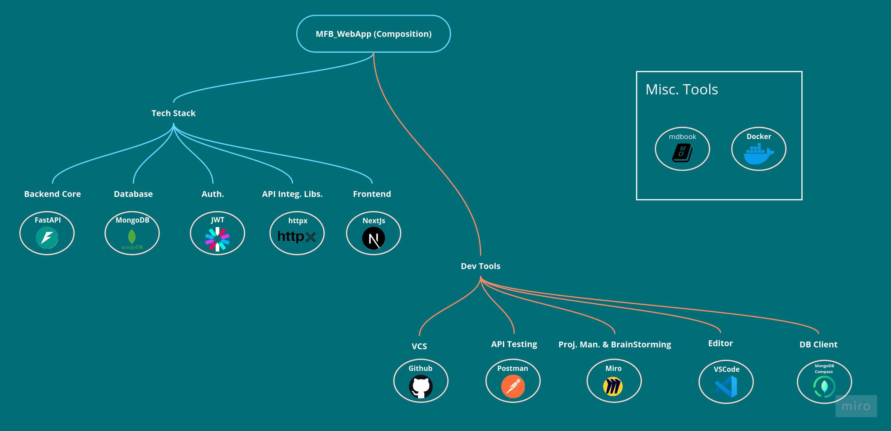

# Environment Setup & Planning

## Tech Stack:

- **FastAPI:** For building the asynchronous RESTful API with Python

- **MongoDB:** For storing and managing data. NoSQL over SQL for scalability and flexibility (for dynamic document structures)

- **JWT:** For authentication and authorization

- **httpx:** For RapidAPI integration

- **NextJs:** For building the frontend application

## Dev. Tools:

- **Github:** For version control and collaboration

- **Postman:** For testing API endpoints

- **Miro:** For project planning and collaboration

- **VS Code:** For coding and debugging

- **MongoDB Compass:** For database management

## Misc. Tools:

- **MDBook:** For documentation

- **Docker:** For containerization and deployment

- **Docker Compose:** For managing and orchestrating containers
