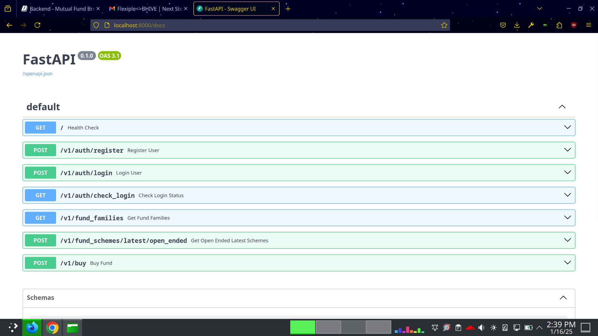

# Overview of Backend API for Mutual Fund Broker Platform

> This page provides a comprehensive overview of the backend architecture, key features, and best practices followed in the implementation.

## 1. Basic Skeleton of the Backend API

**Framework:** The backend is built using **FastAPI**, known for its high performance, intuitive design and asynchronous capabilities.

**Directory Structure:**

`main.py`: Entry point of the application, responsible for initializing the FastAPI app and configuring middleware.

`api/`: Contains versioned API routes (e.g., `api/v1/api.py`).

`.env`: Used for managing environment-specific variables. **(deprecated as application has been Dockerized; Handled by docker-compose)**

`Dockerfile`: Defines the containerization setup.

**Middleware:** Configured CORS middleware to allow frontend-origin requests.

**Versioning:** The API follows a versioning pattern (`v1`), enabling future expansions without breaking existing functionality.

## 2. Session Management

**Authentication:** Implemented using JWT or session tokens to manage user sessions securely. FastAPI’s dependency injection allows easy integration of authentication logic.

User State Management: Session information is stored securely, leveraging databases stores (MongoDB).

## 3. Caching for Integrated APIs

**Caching Strategy:**

External API calls (**to RapidAPI**) only for the **(`/v1/fund_families`) endpoint** are cached using a **json file** (No switching from/to RapidAPI implemented) for simplicity.

## 4. Dockerization

**Containerization:**

The container dependencies of the application are built using Docker, ensuring consistent deployment across environments.

## 5. Best Practices Followed

**Versioning:** 

The API adopts a version-based structure (`v1`), ensuring compatibility for future updates.

**Environment Configuration:**

Sensitive data (e.g., database credentials, API keys) is managed via an `.env` file. (deprecated due to Dockerization)

The use of `python-dotenv` or similar libraries ensures secure and flexible environment management.

**CORS Middleware:**

Configurations are possible to restrict API access to specific frontend origins, enhancing security.

## 6. Additional Features

**Scalability:**

FastAPI’s async capabilities make it inherently scalable for high-concurrency applications.

**Automatic Documentation: (Internal)**

FastAPI’s built-in Swagger UI provides an interactive interface for API testing and exploration.

**Error Handling:**

Standardized exception handling ensures consistent error responses.