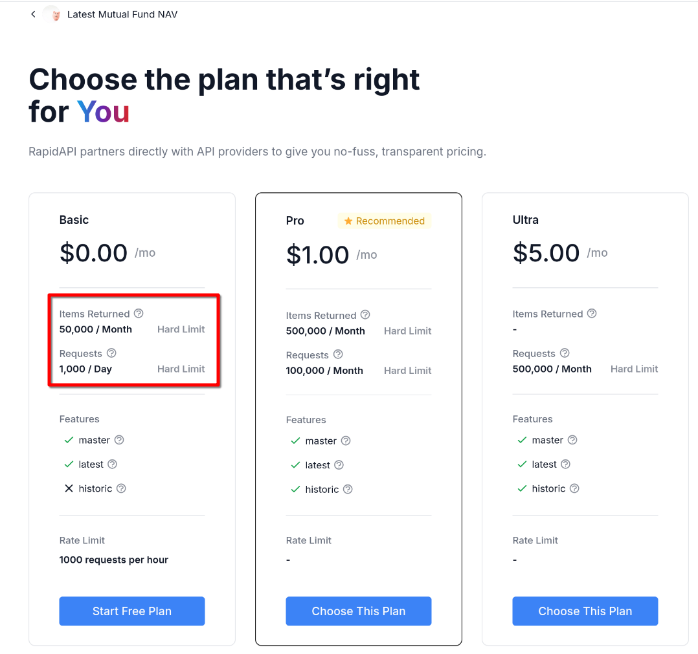
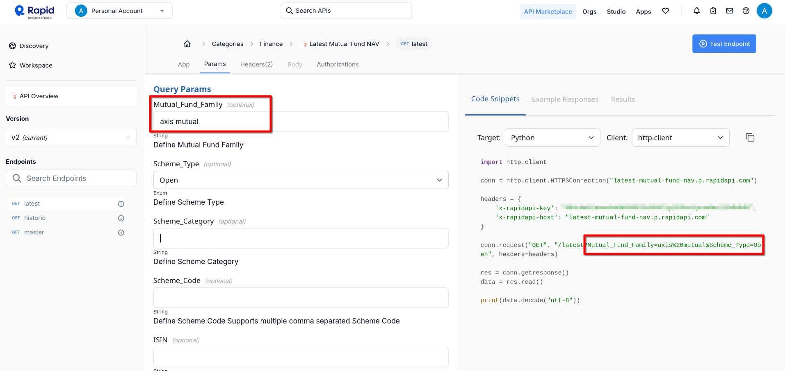

# Rapid API Integration & Protected Endpoints



## Things to consider:

- How large is the response data?

    **50,000 items returned** per month hard limit would likely be an **issue** and the API would be **exhausted quickly** if the response json data is **large (which is the actual case).**

- How many requests would be made?

    The predicted request rate (for a demo use case) is **low to moderate** which doesn't pose as a major concern because of the 1000 requests per hour limit.

---

## 1. Exhaustive Implementation

**RapidAPIService to get all the open ended schemes**
```python
# /api/v1/services/rapidapi_mutfund.py

import httpx
from api.v1.config import CONFIG

class RapidAPIService:
    @staticmethod
    async def fetch_latest_open_ended_schemes():
        """
        Fetch latest schemes for the selected fund family from the /latest endpoint.
        Fetches all mutual fund schemes without any built-in filtering 
        """
        url = f"{CONFIG['RAPID_URL']}/latest?Scheme_Type=Open"  # Appending /latest to the base URL
        headers = {
            "X-RapidAPI-Key": CONFIG["RAPID_MUT_FUND_KEY"],
            "X-RapidAPI-Host": "latest-mutual-fund-nav.p.rapidapi.com"
        }
        # params = {"RTA_Agent_Code": fund_family}

        async with httpx.AsyncClient() as client:
            response = await client.get(url, headers=headers)
            response.raise_for_status()  # Raise an exception for HTTP errors
            return response.json()
```

**Filtering the response to provide the data only for the requested fund family**
```python
@router.get("/fund_schemes/latest/open_ended")
async def get_open_ended_latest_schemes(
    request: FundFamilyRequest,
    authorization: str = Header(None)
):
    """
    Fetch latest schemes for the selected fund family using the /latest endpoint.
    """
    if authorization is None:
        raise HTTPException(status_code=401, detail="Authorization token is missing.")

    # Extract the token from "Bearer <token>"
    token_prefix = "Bearer "
    if not authorization.startswith(token_prefix):
        raise HTTPException(status_code=401, detail="Invalid authorization header format.")
    
    token = authorization[len(token_prefix):]  # Get the actual token

    try:
        # Validate and decode the token
        current_user = AuthSecurity.get_current_user(token)

        # Fetch data from RapidAPI
        all_schemes = await RapidAPIService.fetch_latest_open_ended_schemes()

        # Filter open-ended schemes for the specific fund family
        ff_open_ended_schemes = [
            scheme for scheme in all_schemes
            if scheme.get("Mutual_Fund_Family") == request.fund_family
            # if scheme.get("Scheme_Type") == "Open Ended Schemes"
            # and scheme.get("Mutual_Fund_Family") == request.fund_family
        ]

        if not ff_open_ended_schemes:
            raise HTTPException(status_code=404, detail="No open-ended schemes found for the given fund family.")

        return {"status": "success", "data": ff_open_ended_schemes}
    except HTTPException as e:
        raise e  # Re-raise HTTP exceptions
    except Exception as e:
        raise HTTPException(status_code=500, detail=f"Internal server error: {str(e)}")
```

## 2. Addressing API Limits

The hard limit of 50000 items is reached faster than the 1000 requests per hour, so after just a handful of successful requests, you're running into the limit.

**Possible Solutions:**
- Check API documentation or usage to see if it implements native filtering



And it does!...

- For real-time data this can be used.

- However, for listing out all the open ended schemes we'd need to go for the exhaustive implementation.

- Or, another possible solution for listing out the open ended schemes is to use caching.

**Updated Service Script**
```python
# /api/v1/services/rapidapi_mutfund.py

import httpx
from api.v1.config import CONFIG
import urllib.parse

class RapidAPIService:
    @staticmethod
    async def fetch_latest_open_ended_schemes():
        """
        Fetch all the open ended schemes
        """

        url = f"{CONFIG['RAPID_URL']}/latest?Scheme_Type=Open"
        headers = {
            "X-RapidAPI-Key": CONFIG["RAPID_MUT_FUND_KEY"],
            "X-RapidAPI-Host": "latest-mutual-fund-nav.p.rapidapi.com"
        }
        
        async with httpx.AsyncClient() as client:
            response = await client.get(url, headers=headers)
            response.raise_for_status()  # Raise an exception for HTTP errors
            return response.json()
        
    @staticmethod
    async def fetch_latest_ff_open_ended_schemes(fund_family):
        """
        Fetch latest schemes for the selected fund family from the /latest endpoint.
        Fetches all mutual fund schemes without any built-in filtering 
        """
        # Encode the string for use in a URL
        encoded_fund_family = urllib.parse.quote(fund_family)

        url = f"{CONFIG['RAPID_URL']}/latest?Scheme_Type=Open&Mutual_Fund_Family={encoded_fund_family}"
        headers = {
            "X-RapidAPI-Key": CONFIG["RAPID_MUT_FUND_KEY"],
            "X-RapidAPI-Host": "latest-mutual-fund-nav.p.rapidapi.com"
        }

        async with httpx.AsyncClient() as client:
            response = await client.get(url, headers=headers)
            response.raise_for_status()  # Raise an exception for HTTP errors
            return response.json()
```

## 3. Endpoints Implementation

### 3.1. Fund Families (GET /v1/fund_families)

**Purpose:** Fetch all open ended schemes and filter all families using the /latest endpoint.

**Request:** `authorization Bearer <token>`

**Response (Success):**
```json
{
    "status": "success",
    "fund_families": [
        "Nippon India Mutual Fund",
        "HDFC Mutual Fund",
        "Invesco Mutual Fund",
        "Quantum Mutual Fund",
        "Aditya Birla Sun Life Mutual Fund",
        "UTI Mutual Fund",
        "ITI Mutual Fund",
        "Taurus Mutual Fund",
        "Navi Mutual Fund",
        "Tata Mutual Fund",
        "DSP Mutual Fund",
        "NJ Mutual Fund",
        "Zerodha Mutual Fund",
        "Sundaram Mutual Fund",
        "SBI Mutual Fund",
        "Baroda BNP Paribas Mutual Fund",
        "Bajaj Finserv Mutual Fund",
        "Canara Robeco Mutual Fund",
        "PGIM India Mutual Fund",
        "Edelweiss Mutual Fund",
        "Helios Mutual Fund",
        "Mahindra Manulife Mutual Fund",
        "Shriram Mutual Fund",
        "Axis Mutual Fund",
        "WhiteOak Capital Mutual Fund",
        "Trust Mutual Fund",
        "Franklin Templeton Mutual Fund",
        "Samco Mutual Fund",
        "Old Bridge Mutual Fund",
        "Bank of India Mutual Fund",
        "Bandhan Mutual Fund",
        "ICICI Prudential Mutual Fund",
        "Groww Mutual Fund",
        "Mirae Asset Mutual Fund",
        "JM Financial Mutual Fund",
        "Motilal Oswal Mutual Fund",
        "Union Mutual Fund",
        "360 ONE Mutual Fund (Formerly Known as IIFL Mutual Fund)",
        "PPFAS Mutual Fund",
        "LIC Mutual Fund",
        "quant Mutual Fund",
        "Kotak Mahindra Mutual Fund",
        "HSBC Mutual Fund"
    ]
}
```

**Response (Error):**
```json
{
    "detail": "Internal server error: <detail>"
}
```

**Implementation**:
```python
@router.get("/fund_families")
async def get_fund_families(
    authorization: str = Header(None)
    ):
    """
    Fetch all open ended schemes and filter all families using the /latest endpoint.
    """
    if authorization is None:
        raise HTTPException(status_code=401, detail="Authorization token is missing.")
    
    # Extract the token from "Bearer <token>"
    token_prefix = "Bearer "
    if not authorization.startswith(token_prefix):
        raise HTTPException(status_code=401, detail="Invalid authorization code.")
    
    token = authorization[len(token_prefix):]  # Get the actual token

    try:
        current_user = AuthSecurity.get_current_user(token)
        # Fetch data from RapidAPI
        all_open_ended_schemes = await RapidAPIService.fetch_latest_open_ended_schemes()

        # Extract and filter fund families from all schemes
        fund_families = list(set(scheme["Mutual_Fund_Family"] for scheme in all_open_ended_schemes))

        if not fund_families:
            raise HTTPException(status_code=404, detail="No fund families found!")

        return {"status": "success", "fund_families": fund_families}
    except HTTPException as e:
        raise e
    except Exception as e:
        raise HTTPException(status_code=500, detail=f"Internal server error: {str(e)}")
```

### 3.2. Open Ended Schemes for a Fund Family (POST /v1/fund_schemes/latest/open_ended)

**Purpose:** Filter out selected fund family and associated details.

**Request:** `authorization Bearer <token>`

**Body: (RAW JSON)**
```json
{
    "fund_family": "Aditya Birla Sun Life Mutual Fund"
}
```

**Response (Success):**
```json
{
    "status": "success",
    "data": [
        {
            "Scheme_Code": 119551,
            "ISIN_Div_Payout_ISIN_Growth": "INF209KA12Z1",
            "ISIN_Div_Reinvestment": "INF209KA13Z9",
            "Scheme_Name": "Aditya Birla Sun Life Banking & PSU Debt Fund  - DIRECT - IDCW",
            "Net_Asset_Value": 102.5067,
            "Date": "14-Jan-2025",
            "Scheme_Type": "Open Ended Schemes",
            "Scheme_Category": "Debt Scheme - Banking and PSU Fund",
            "Mutual_Fund_Family": "Aditya Birla Sun Life Mutual Fund"
        },
        {
            "Scheme_Code": 119552,
            "ISIN_Div_Payout_ISIN_Growth": "INF209K01YM2",
            "ISIN_Div_Reinvestment": "-",
            "Scheme_Name": "Aditya Birla Sun Life Banking & PSU Debt Fund  - DIRECT - MONTHLY IDCW",
            "Net_Asset_Value": 115.5344,
            "Date": "14-Jan-2025",
            "Scheme_Type": "Open Ended Schemes",
            "Scheme_Category": "Debt Scheme - Banking and PSU Fund",
            "Mutual_Fund_Family": "Aditya Birla Sun Life Mutual Fund"
        }
    ]
}
```

**Response (Error):**
```json
{
    "detail": "Internal server error: Client error '403 Forbidden' for url 'https://latest-mutual-fund-nav.p.rapidapi.com/latest?Scheme_Type=Open&Mutual_Fund_Family=Aditya%20Birla%20Sun%20Life%20Mutual%20Fund' For more information check: https://developer.mozilla.org/en-US/docs/Web/HTTP/Status/403"
    // or the backend offline error
}
```

**Implementation**:
```python
@router.post("/fund_schemes/latest/open_ended")
async def get_open_ended_latest_schemes(
    request: FundFamilyRequest,
    authorization: str = Header(None)
):
    """
    Filter out selected fund family and associated details.
    """
    if authorization is None:
        raise HTTPException(status_code=401, detail="Authorization token is missing.")

    # Extract the token from "Bearer <token>"
    token_prefix = "Bearer "
    if not authorization.startswith(token_prefix):
        raise HTTPException(status_code=401, detail="Invalid authorization header format.")
    
    token = authorization[len(token_prefix):]  # Get the actual token

    try:
        # Validate and decode the token
        current_user = AuthSecurity.get_current_user(token)

        # Fetch data from RapidAPI
        all_schemes = await RapidAPIService.fetch_latest_ff_open_ended_schemes(request.fund_family)

        return {"status": "success", "data": all_schemes}
    
    except HTTPException as e:
        raise e  # Re-raise HTTP exceptions
    except Exception as e:
        raise HTTPException(status_code=500, detail=f"Internal server error: {str(e)}")
```

### 3.3. Buy Mutual Fund Units (POST /v1/buy)

**Request**: `authorization Bearer <token>`

**Implementation**
```python
@router.post("/buy")
async def buy_fund(
    request: BuyRequest,
    authorization: str = Header(None)  
):
    """
    Endpoint to simulate the purchase of mutual fund units.

    Args:
        request (BuyRequest): Request body containing Scheme_Code and units.
        authorization (str): JWT token for user authentication.

    Returns:
        dict: Confirmation of the simulated purchase or an error message.
    """
    if authorization is None:
        raise HTTPException(status_code=401, detail="Authorization token is missing.")

    # Extract the token from "Bearer <token>"
    token_prefix = "Bearer "
    if not authorization.startswith(token_prefix):
        raise HTTPException(status_code=401, detail="Invalid authorization header format.")
    
    token = authorization[len(token_prefix):]  # Get the actual token
    try:
        current_user = AuthSecurity.get_current_user(token)
        user_email = current_user["email"]  # Use email as the unique identifier
        scheme_code = request.Scheme_Code
        units = request.units
        nav = request.nav

        if units <= 0:
            raise HTTPException(status_code=400, detail="Units must be greater than 0.")

        if nav <= 0:
            raise HTTPException(status_code=400, detail="NAV must be greater than 0.")

        # Calculate total cost
        total_cost = nav * units

        # Check if the user already has a purchase for this Scheme_Code
        existing_purchase = await mongo_service.find_one(
            db_name,
            collection_name,
            {"email": user_email, "Scheme_Code": scheme_code}
        )

        if existing_purchase:
            # Update the existing purchase
            updated_units = existing_purchase["units"] + units
            updated_total_cost = updated_units * nav  # Recalculate total cost
            await mongo_service.update_one(
                db_name,
                collection_name,
                {"_id": existing_purchase["_id"]},
                {
                    "units": updated_units,
                    "total_cost": updated_total_cost,
                    "last_updated": datetime.now(timezone.utc)
                }
            )
            action = "updated"
        else:
            # Create a new purchase record
            new_purchase = {
                "email": user_email,
                "Scheme_Code": scheme_code,
                "units": units,
                "Net_Asset_Value": nav,
                "total_cost": total_cost,
                "purchase_date": datetime.now(timezone.utc)
            }
            await mongo_service.insert_one(db_name, collection_name, new_purchase)
            action = "created"
            
        # Respond with success
        return {
            "status": "success",
            "message": f"Purchase {action} successfully.",
            "Scheme_Code": scheme_code,
            "units": units,
            "total_cost": f"{total_cost:.2f}",
        }

    except HTTPException as e:
        raise e  # Re-raise HTTP exceptions
    except Exception as e:
        raise HTTPException(status_code=500, detail=f"Internal server error: {str(e)}")
```


### 3.4. Portfilio (GET /v1/portfolio)

**Purpose:** Retrieve a user's portfolio information.

**Request:** `authorization Bearer <token>`


**Response (Success):**
```json
{
    "status": "success",
    "portfolio": [
        {
            "_id": "6788d84d02c0eeb63a66b7b2",
            "email": "user@mfb.com",
            "Scheme_Code": 119551,
            "Scheme_Name": "Aditya Birla Sun Life Banking & PSU Debt Fund  - DIRECT - IDCW",
            "Date": "14-Jan-2025",
            "Scheme_Category": "Debt Scheme - Banking and PSU Fund",
            "ISIN_Div_Payout_ISIN_Growth": "INF209KA12Z1",
            "ISIN_Div_Reinvestment": "INF209KA13Z9",
            "units": 3,
            "Net_Asset_Value": 102.5067,
            "total_cost": 307.52009999999996,
            "purchase_date": "2025-01-16T09:58:37.368000",
            "last_updated": null
        }
    ]
}
```

**Response (Error):**
```json
{
    "status": "error",
    "message": "No purchases found for this user."
}
```

**Implementation:**
```python
@router.get("/portfolio")
async def get_portfolio(authorization: str = Header(None)):
    """
    Fetch the portfolio of the current user.

    Args:
        authorization (str): JWT token for user authentication.

    Returns:
        dict: A list of all mutual fund purchases by the user.
    """
    if authorization is None:
        raise HTTPException(status_code=401, detail="Authorization token is missing.")

    # Extract the token from "Bearer <token>"
    token_prefix = "Bearer "
    if not authorization.startswith(token_prefix):
        raise HTTPException(status_code=401, detail="Invalid authorization header format.")
    
    token = authorization[len(token_prefix):]  # Get the actual token

    try:
        # Validate and decode the token
        current_user = AuthSecurity.get_current_user(token)
        user_email = current_user["email"]  # Use email as the unique identifier

        # Fetch all purchase records for the user
        purchases = await mongo_service.find_all(
            db_name,
            collection_name,
            {"email": user_email}
        )

        if not purchases:
            return JSONResponse(
                status_code=404,
                content={"status": "error", "message": "No purchases found for this user."}
            )

        # Convert ObjectId to string and format the response
        portfolio = [
            {
                "_id": str(purchase["_id"]),
                "email": purchase["email"],
                "Scheme_Code": purchase["Scheme_Code"],
                "Scheme_Name": purchase["Scheme_Name"],
                "Date": purchase["Date"],
                "Scheme_Category": purchase["Scheme_Category"],
                "ISIN_Div_Payout_ISIN_Growth": purchase["ISIN_Div_Payout_ISIN_Growth"],
                "ISIN_Div_Reinvestment": purchase["ISIN_Div_Reinvestment"],
                "units": purchase["units"],
                "Net_Asset_Value": purchase["Net_Asset_Value"],
                "total_cost": purchase["total_cost"],
                "purchase_date": purchase["purchase_date"].isoformat(),
                "last_updated": purchase.get("last_updated", "").isoformat() if purchase.get("last_updated") else None,
            }
            for purchase in purchases
        ]

        return {"status": "success", "portfolio": portfolio}

    except HTTPException as e:
        raise e  # Re-raise HTTP exceptions
    except Exception as e:
        raise HTTPException(status_code=500, detail=f"Internal server error: {str(e)}")
```