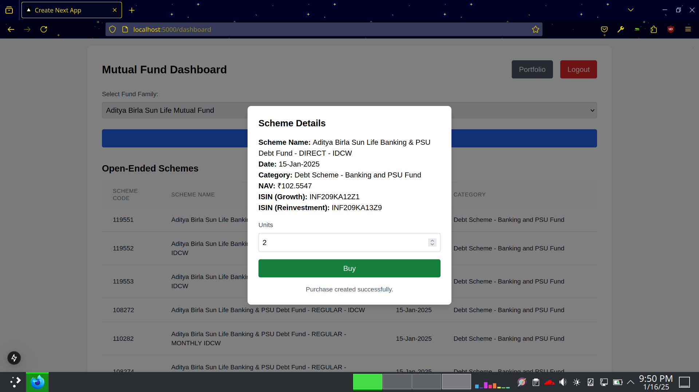

# Cron Job for Hourly NAV Update

## Update NAV & total cost of a `scheme_document` owned by a user

```python
async def update_nav_and_total_cost(scheme_document):
    scheme_code = scheme_document['Scheme_Code']
    units = scheme_document['units']

    # fetch NAV data from RapidAPI
    api_data = await RapidAPIService.fetch_oes_schemes(scheme_code)
    if api_data and api_data['status'] == 'success':
        latest_nav = api_data['data'][0]['Net_Asset_Value']

        # Calculate new total_cost
        new_total_cost = latest_nav * units

        # Update MongoDB

        # Check for the  purchase for this Scheme_Code
        purchase = await mongo_service.find_one(
            db_name,
            collection_name,
            {"Scheme_Code": scheme_code},
        )

        if purchase:
            # Update the purchase document
            await mongo_service.update_one(
                db_name,
                collection_name,
                {"_id": purchase["_id"]},
                {
                    "Net_Asset_Value": latest_nav, 
                    "total_cost": new_total_cost
                }
            )
            return { "status": "success", "message": "NAV and total_cost updated successfully" }
        else:
            return { "status": "error", "message": "No purchase found for this Scheme Code" }
```

- So the idea is to iterate through all the user documents in the collection on a hourly basis supplying the document to this update function.

- The update function fetches the latest NAV from RapidAPI and calculates the new total cost.

- This way the users can track their investments on a hourly basis.


## Functionality testing

We can make a test endpoint to validate this function with a hardcoded `Scheme_Code`.

```python
@router.get("/portfolio/update")
async def test_endpoint():
    scheme_doc = await mongo_service.find_one(
        db_name,
        collection_name,
        {"Scheme_Code": 119551}
    )
    if not scheme_doc:
        return { "status": "error", "message": "No scheme found." }
    result = await update_nav_and_total_cost(scheme_doc)
    return result
```

and have the RapidAPIService fetch the current data for that particular scheme


```python
    @staticmethod
    async def fetch_oes_schemes(scheme_code): # Using scheme code
        """
        Fetch latest schemes for the selected fund family from the /latest endpoint.
        Fetches all mutual fund schemes without any built-in filtering 
        """
        # Encode the string for use in a URL
        encoded_scheme_code = urllib.parse.quote(str(scheme_code))

        url = f"{CONFIG['RAPID_URL']}/latest?Scheme_Type=Open&Scheme_Code={encoded_scheme_code}"
        headers = {
            "X-RapidAPI-Key": CONFIG["RAPID_MUT_FUND_KEY"],
            "X-RapidAPI-Host": "latest-mutual-fund-nav.p.rapidapi.com"
        }

        # Dev for UI
        # Instead of using the API we can manually change the NAV here to test the function
        return {
            "status": "success",
            "data": [
                {
                    "Scheme_Code": 119551,
                    "ISIN_Div_Payout_ISIN_Growth": "INF209KA12Z1",
                    "ISIN_Div_Reinvestment": "INF209KA13Z9",
                    "Scheme_Name": "Aditya Birla Sun Life Banking & PSU Debt Fund  - DIRECT - IDCW",
                    "Net_Asset_Value": 167.57, # This is the value we want to update
                    "Date": "14-Jan-2025",
                    "Scheme_Type": "Open Ended Schemes",
                    "Scheme_Category": "Debt Scheme - Banking and PSU Fund",
                    "Mutual_Fund_Family": "Aditya Birla Sun Life Mutual Fund"
                }
            ]
            }

        async with httpx.AsyncClient() as client:
            response = await client.get(url, headers=headers)
            response.raise_for_status()  # Raise an exception for HTTP errors
            return response.json()
```



### Before Update


### Force Update with Postman


### After Update

**MongoDB Compass Check**


**UI view after refresh**


## Scheduling the NAV update

Instead of using something like AP scheduler which is over kill for this simple task, we can use a simple while true and sleep for 1 hour to update the NAV every hour.

However, here the idea for AP scheduler
```
from apscheduler.schedulers.asyncio import AsyncIOScheduler

async def run_hourly_updates():
    # Scheduler for running hourly
    scheduler = AsyncIOScheduler()
    
    @scheduler.scheduled_job('interval', hours=1)
    async def hourly_update():
        all_schemes = await get_all_scheme_codes()
        for scheme in all_schemes:
            await update_nav_and_total_cost(scheme)
    
    scheduler.start()
```

And here is the simpler while implementation

```python
async def run_hourly_updates():
    while True:
        # Get all scheme documents
        scheme_documents = await get_all_scheme_documents()
        for scheme_document in scheme_documents:
            await update_nav_and_total_cost(scheme_document)
            # Sleep for 1 hour
            await asyncio.sleep(3600)
```

This can be added to startup alongside the uvicorn server using the following logic

```python
async def run_hourly_updates():
    while True:
        # Get all scheme documents
        scheme_documents = await get_all_scheme_documents()
        for scheme_document in scheme_documents:
            # Sleep for 1 hour: before (more practical to not have updates on every startup)
            await asyncio.sleep(3600)
            await update_nav_and_total_cost(scheme_document)
```