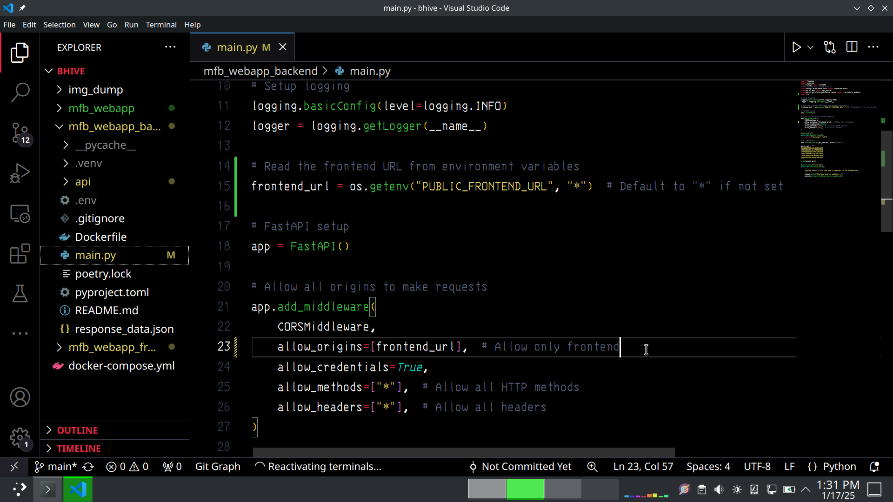

# Deployment Fixes, Dry Run & Production Testing

> I used **Docker Compose** to deploy the container cluster on Google Cloud Platform (GCP). During deployment, I encountered some backend connectivity issues related to **CORS** (Cross-Origin Resource Sharing), which I subsequently addressed to ensure proper communication between the frontend and backend.

## Network & CORS patches

**IP & CORS Issue**

**Axios Patch (in all backend calls)**

**CORS Patch (in backend middleware)**
